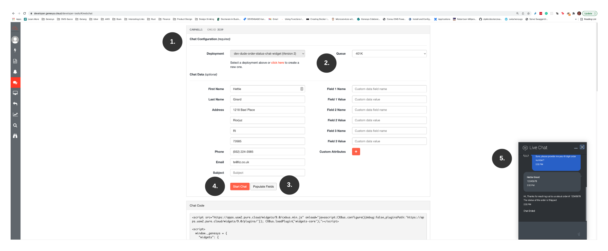

This Genesys Cloud Developer blueprint demonstrates how to build a web chat-based chatbot using Genesys Cloud's web chat and bot capabilities and integrating that chatbot with an AWS lambda. All the components used in this solution can be deployed using Terraform, the Terraform AWS provider, and the Terraform Genesys Cloud CX as Code provider.  


:::{"alert":"info","title":"Important Information","collapsible":false,"autoCollapse":false}
While Genesys still supports web chats, Genesys is investing in its next generation messaging platform, [Web messaging](https://developer.genesys.cloud/commdigital/digital/webmessaging/ "Goes to the Web messaging and Messenger page).

Leverage this blueprint **only** if you have existing web chat deployments. Otherwise, review the [sister blueprint](https://github.com/GenesysCloudBlueprints/deploy-webmessaging-chatbot-with-lambda-blueprint) that delivers the same solution using Web Messaging.
:::

## Scenario

An organization is interested in building a chatbot that allows customers to check the status of an order they have placed. The development team wants to: 

* Quickly implement a chatbot on the company website with minimal coding effort.
* Implement a chatbot across multiple contact center channels. Initially, the bot flow will process inbound chats. By designing the flow in a non-channel-specific way, the dev team will be able to integrate it with a voice channel later.
* Integrate the chatbot with an existing AWS Lambda that looks up the order status for a customer. By promoting reuse, the development team will speed up delivery and demonstrate efficient design.

## Solution

This blueprint explains how to use the following Genesys Cloud capabilities: 

* **Architect bot flow** - allows you to define the words and intents associated with speech and text detection in a chat or voice bot. The bot flow leverages machine learning to communicate intelligently with customers.
* **Architect inbound chat flow** - provides the integration and the routing layer that gets the customer to the right information or people.
* **Data action** provides the integration to the AWS Lambda that looks up a customer's order status.
* **Web chat widget** - allows developers to create and configure a JavaScript web chat widget that deploys to their organization's website where customers interact with it.

Additionally, this blueprint explains how to deploy the AWS Lambda, all the AWS IAM roles, and all the CX as Code components from within a single Terraform/CX as Code project.

## Solution components

* **Genesys Cloud CX** - A suite of Genesys Cloud services for enterprise-grade communications, collaboration, and contact center management. In this solution, you use an Architect bot flow, Architect inbound chat flow, and a Genesys Cloud integration, data action, queues, and web chat widget.
* **Archy** - A Genesys Cloud command-line tool for building and managing Architect flows.
* **CX as Code** - A Genesys Cloud Terraform provider that provides an interface for declaring core Genesys Cloud objects.
* **AWS Terraform Provider** - An Amazon-supported Terraform service provides an interface for declaring AWS infrastructure resources including EC2, Lambda, EKS, ECS, VPC, S3, RDS, DynamoDB, and more.
* **AWS Lambda** - A serverless computing service for running code without creating or maintaining the underlying infrastructure. In this solution, AWS Lambda looks up a customer's order status.  

## Prerequisites

### Specialized knowledge

* Administrator-level knowledge of Genesys Cloud
* AWS Cloud Practitioner-level knowledge of AWS IAM and AWS Lambda
* Experience with Terraform

### Genesys Cloud account

* A Genesys Cloud license. For more information see, [Genesys Cloud Pricing](https://www.genesys.com/pricing "Goes to the Genesys Cloud pricing page") in the Genesys Cloud website. For this project, you need at least a Genesys Cloud CX 3 license and a botFlows product for your organization.
* Master Admin role. For more information see, [Roles and permissions overview](https://help.mypurecloud.com/?p=24360 "Goes to the Roles and permissions overview article") in the Genesys Cloud Resource Center.
* Archy. For more information see, [Welcome to Archy](https://developer.genesys.cloud/devapps/archy/ "Goes to the Welcome to Archy page") in the Genesys Cloud Developer Center.
* CX as Code. For more information see, [CX as Code](https://developer.genesys.cloud/api/rest/cx-as-code/ "Goes to the CX as Code page") in the Genesys Cloud Developer Center.

### AWS account

* An administrator account with permissions to access these services:
  * AWS Identity and Access Management (IAM)
  * AWS Lambda
  * AWS credentials
  
### Development tools running in your local environment

* Terraform (the latest binary). For more information, see [Download Terraform](https://www.terraform.io/downloads.html "Goes to the Download Terraform page") on the Terraform website.
* Golang 1.16 or higher. For more information, see [Download Golang](https://go.dev/ "Goes to the Go programming languge page") on the Go website. 
* Archy (the latest version). Archy is Genesys Cloud's command line to deploy Genesys Cloud Architect flows. For more information, see: 

  * [Archy Documentation](https://developer.genesys.cloud/devapps/archy/ "Goes to the Welcome to Archy page")
  * [Installing and Configuring Archy - Video](https://www.youtube.com/watch?v=fOI_vq3PnM8 "Goes to the DevDrop 8a: Installing and configuring Archy video") in YouTube
  * [Exporting flows with Archy - Video](https://www.youtube.com/watch?v=QAmkM_agsrY "Goes to the DevDrop 8b: Exporting flows with Archy video") in YouTube
  * [Importing flows with Archy - Video](https://www.youtube.com/watch?v=3NwGJ9X1O0s "Goes to the DevDrop 8c: Importing an Architect flow using Archy video") in YouTube

## Implementation steps

### Clone the GitHub repository

Clone the [deploy-webchat-chatbot-with-lambda-blueprint](https://github.com/GenesysCloudBlueprints/deploy-webchat-chatbot-with-lambda-blueprint) GitHub repository on your local machine. The deploy-webchat-chatbot-with-lambda-blueprint/blueprint folder includes solution-specific scripts and files in these subfolders:

* lambda-orderstatus - Source code for the AWS Lambda used in this application
* terraform - All Terraform files and Architect flows that are needed to deploy the application

### Set up your AWS credentials

For information about setting up your AWS credentials on your local machine, see [About credential providers](https://docs.aws.amazon.com/sdkref/latest/guide/creds-config-files.html "Goes to the About credential providers page") on the AWS page.

### Set up your Genesys Cloud credentials

1. To run this project using the AWS Terraform provider, open a terminal window and set the following environment variables:

 * `GENESYSCLOUD_OAUTHCLIENT_ID` - This is the Genesys Cloud client credential grant Id that CX as Code executes against. 
 * `GENESYSCLOUD_OAUTHCLIENT_SECRET` - This is the Genesys Cloud client credential secret that CX as Code executes against. 
 * `GENESYSCLOUD_REGION` - This is the Genesys Cloud region in your organization.
 * `AWS_ACCESS_KEY_ID` - This is the AWS Access Key you must set up in your Amazon account to allow the AWS Terraform provider to act against your account.
 * `AWS_SECRET_ACCESS_KEY` - This is the AWS Secret you must set up in your Amazon account to allow the AWS Terraform provider to act against your account.

2. Run Terraform in the terminal window where the environment variables are set. 

:::primary
**Note:** For this project, the Genesys Cloud OAuth client requires the Master Admin role. 
:::

### Optionally update the AWS Lambda

If you want changes to the AWS Lambda, the source code can be found in the lambda-orderstatus folder. To build this Lambda, you need the Golang SDK. For the latest Golang version, see [The Go programming language](https://go.dev/dl/ "Goes to the Downloads page on the Go website"). 

To rebuild the Lambda from the source code:

1. Install the Golang SDK on your local machine.
2. Change to the blueprint/lambda-orderstatus folder.
3. Issue this build command: `GOOS=linux go build -o bin/main ./...`

This builds a Linux executable called `main` in the `bin` directory.  The CX as Code scripts compress this executable and deploy the zip as part of the AWS Lambda deploy via Terraform.

:::primary
**Note**: The executable runs only on Linux. Golang allows you build Linux executables on Windows and OS/X, but you will not be able to run them locally.**
:::

### Configure your Terraform build

You must define several values that are specific to your AWS region and Genesys Cloud organization. 

In the blueprint/terraform/dev.auto.tfvars file, set the following values:

* `organizationId` - Your Genesys Cloud organization ID
* `awsRegion` - The AWS region (for example us-east-1, us-west-2) where you are going to deploy the target AWS lambda.
* `environment` - This is a free-form field that combines with the prefix value to define the name of various AWS and Genesys Cloud artifacts. For example, if you set the environment name to be `dev` and the prefix to be `dude-order-status` your AWS lambda, IAM roles, Genesys Cloud Integration and Data Actions will all begin with `dev-dude-order-status`.
* `prefix`- This a free-form field that combines with the environment value to define the name of various AWS and Genesys Cloud artifacts.

The following is an example of the dev.auto.tfvars file that was created by the author of this blueprint.

```
organizationId = "011a0480-9a1e-4da9-8cdd-2642474cf92a"
awsRegion              = "us-west-2"
environment            = "dev"
prefix                 = "dude-order-status"
```

:::primary
**Note**: If you change the environment and prefix, make sure you change the name of the Lambda inside the blueprints/terraform/architect-flows/DudeWheresMyStuffChat_v23-0.yaml file to the name of the new Lambda.
:::

### Run Terraform

You are now ready to run this blueprint solution for your organization. 

1. Change to the blueprints/terraform folder and issue these commands:

* `terraform plan` - This executes a trial run against your Genesys Cloud organization and shows you a list of all the AWS, and Genesys Cloud resources created. Review this list and make sure you are comfortable with the activity being undertake before continuing to the second step.

* `terraform apply --auto-approve` - This does the actual object creation and deployment against your AWS and Genesys Cloud accounts. The --auto--approve flag steps the approval step required before creating the objects.

After the `terraform apply --auto-approve` command has completed, you should see the output of the entire run along with the number of objects successfully created by Terraform. Keep these points in mind:

*  This project assumes you are running using a local Terraform backing state. This means that the `tfstate` files will be created in the same directory where you ran the project. Terraform does not recommend using local Terraform backing state files unless you run from a desktop and are comfortable with the deleted files.

* As long as your local Terraform backing state projects are kept, you can tear down the blueprint in question by changing to the `blueprint/terraform` directory and issuing a `terraform destroy --auto-approve` command. This destroys all objects currently managed by the local Terraform backing state.

### Test your deployment

After the chatbot is deployed to your environment, use the Genesys Cloud Web Chat feature to test it.  



1. Go to the [Web Chat developer tool](https://developer.genesys.cloud/developer-tools/#/webchat) in the Genesys Cloud Developer Center.  
2. From the **Deployment** list, select your chat deployment. In the diagram above, the sample deployment would appear as `dev-dude-order-status-chat-widget`. If you do not see your chat deployment, the web chat widget did not deploy correctly.
3. Select a queue. This is a requirement of the Web Chat developer tool. For this example, the 401K queue within my organization was selected.
4. To quickly complete the **Chat Data** fields, click **Populate Fields**.  
5. Click **Start Chat**. This button initiates a chat with your organization. After the chat starts, you are greeted by a chat bot that asks, "How can I help you with your order today?". 
6. Respond by entering **order status**. 
7. When prompted for your 8-digit order number, enter **12345678**. 

You should see the response of **Hi, Thanks for reaching out to us about order #: 12345678. The status of the order is Shipped**. If you receive this response, the chat bot has successfully connected with the AWS lambda, which then successfully processed your request for the order status.

If you receive a message from a chatbot that there was a problem with your order, the AWS lambda did not deploy properly and Genesys Cloud had a problem invoking it.

## Additional resources

* [Genesys Cloud web chat](https://developer.genesys.cloud/commdigital/digital/webchat/ "Goes to the Web Chat page") 
* [About widgets for web chat](https://help.mypurecloud.com/articles/about-widgets-for-web-chat/ "Goes to the About widgets for web chat article") in the Genesys Cloud Resource Center
* [Genesys Cloud Web messaging and messenger](https://developer.genesys.cloud/commdigital/digital/webmessaging/ "Goes to the Web messaging and Messenger page")
* [About Web messaging and messenger](https://help.mypurecloud.com/?p=228564 "Goes to the About Web messaging and messenger article) in the Genesys Cloud Resource Center
* [Genesys Cloud About the data actions integrations](https://help.mypurecloud.com/?p=209478 "Goes to About the data actions integrations article") in the Genesys Cloud Resource Center
* [Genesys Cloud About the AWS Lambda Data Actions integration](https://help.mypurecloud.com/?p=178553 "Goes to About the AWS Lambda Data Actions integration article") in the Genesys Cloud Resource Center
* [AWS Lambda](https://aws.amazon.com/lambda/ "Opens the AWS Lambda page") in the Amazon documentation
* [Genesys Cloud Terraform provider documentation](https://registry.terraform.io/providers/MyPureCloud/genesyscloud/latest/docs "Goes to the Genesys Cloud provider page") in the Terraform documentation
* [Genesys Cloud DevOps repository](https://github.com/GenesysCloudDevOps "Goes to the Genesys Cloud DevOps repository page") in GitHub
* [deploy-webchat-chatbot-with-lambda-blueprint](https://github.com/GenesysCloudBlueprints/deploy-webchat-chatbot-with-lambda-blueprint "Goes to the deploy-webchat-chatbot-with-lambda-blueprint repository") in GitHub
* [deploy-webmessaging-chatbot-with-lambda-blueprint](https://github.com/GenesysCloudBlueprints/deploy-webmessaging-chatbot-with-lambda-blueprint "Goes to the deploy-webmessaging-chatbot-with-lambda-blueprint repository") in GitHub
