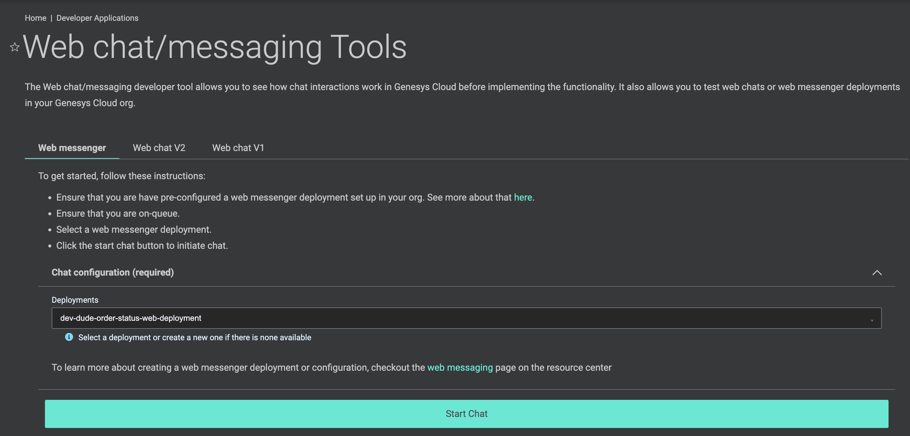

REMOVED FRONT MATTER 
title: Build a Chatbot calling an AWS Lambda via a Genesys Cloud Data Action
author: john.carnell
indextype: blueprint
icon: blueprint
image: images/images.png
category: 5
summary: |
  This Genesys Cloud Developer Blueprint demonstrates how to build a chatbot using Genesys Cloud's Web Chat capabilities and integrating that chatbot with an AWS lambda
REMOVED FRONTMATTER

This Genesys Cloud Developer Blueprint demonstrates how to build a chatbot using Genesys Cloud's Web Chat capabilities and integrating that chatbot with an AWS lambda. In addition, this blueprint will demonstrate how to invoke an AWS lambda using Genesys Cloud Data Action.

This blueprint also demonstrates how to:

* Build a bot Genesys Cloud Architect Flow that can be integrated with a Genesys Cloud Architect inbound chat flow.
* Built an inbound chat Genesys Cloud Architect flow. 
* Deploy the inbound Chat flow using a Genesys Cloud Chat widget.
* Integrate an AWS Lambda in the inbound chat flow using a Genesys Cloud Data Action.
* Deploy both the AWS Lambda, all AWS IAM roles and CX as Code components all from within a single Terraform/CX as Code project.

## Scenario

An organization is interesting in build a service service chat bot that will allow a customer to find out the status of an order they have placed. The goal with this chat bot is to:

* **Implement a chatbot that can be implemented multiple contact center channels.** - The development team wants to quickly stand up a bot flow that can be used to process inbound chats.  However, they want to leverage this flow in a non-channel specific way so that at some point in the future it can be integrated into with a voice channel.

* **Implement a chatbot on their company website.** - The company wants to be able to deliver the chatbot on their company website with minimal coding effort.

* **Integrate their chatbot with an AWS lambda to look up the order status for a customer** - The organization already has an AWS lambda that they use in other places for looking up customer order information. They want to reuse this lambda in their chatbot to speed overall delivery velocity and promote re-use.

## Solution

The organization can leverage Genesys Cloud Architect bot flows, inbound chat, data actions and chat widget to build their chatbot. These Genesys Cloud components can provide the following capabilities:

1. **Bot Flow**. This is a Genesys Cloud Architect Flow that allows you to define the utterances and intents associated with speech and text detection in a chat or voice bot. 
2. **Inbound Chat**. This is a Genesys Cloud Architect Flow that builds on top of a Genesys Cloud Bot flow. The inbound chat flow provides the integration and routing layer getting the customer to the right information or people.  
3. **Data Action**. A Genesys Cloud Data Action provides the integration point out to a third-party REST web service or AWS lambda.
4. **Chat Widget**. The Genesys Cloud Chat widget allows you to configure and create a Javascript chat widget that can deployed into an organization's web site.

All of these Genesys Cloud components, along with the AWS lambda used to look up a customer's order status, can be deployed by using Terraform, the Terraform AWS provider and the Terraform Genesys Cloud CX as Code provider. The diagram below illustrates all of the Terraform providers and the resources they will create.  


## Contents

* [Solution components](#solution-components "Goes to the Solution components section")
* [Software development kits](#software-development-kits "Goes to the Software development kits section")
* [Prerequisites](#prerequisites "Goes to the Prerequisites section")
* [Implementation steps](#implementation-steps "Goes to the Implementation steps section")
* [Additional resources](#additional-resources "Goes to the Additional resources section")

## Solution components

* **Genesys Cloud** - A suite of Genesys Cloud services for enterprise-grade communications, collaboration, and contact center management. In this solution, you use an Architect bot, Architect chat flow, and a Genesys Cloud integration, data action, queues, and chat widget.
* **Archy** - A Genesys Cloud command-line tool for building and managing Architect flows.
* **CX as Code** - A Genesys Cloud Terraform provider that provides an interface for declaring core Genesys Cloud objects.
* **AWS Terraform Provider** - An Amazon supported Terraform provides an interface for declaring Amazon Web Services infrastructure.
* **AWS Lambda** - A serverless computing service for running code without creating or maintaining the underlying infrastructure. In this solution, AWS Lambda processes requests that come through the Amazon API Gateway and calls the Amazon Comprehend endpoint. For more information, see [AWS Lambda](https://aws.amazon.com/translate/ "Opens the Amazon AWS Lambda page") in the Amazon featured services website. 

## Software development kits

There are no required SDKs needed for this project.  This project contains everything you need to deploy the blueprint, including a pre-compiled version of the AWS lambda. 

If you wish to make changes to the AWS lambda, the source code can be found in the `lambda-orderstatus` directory.  To build this lambda, you will need the Golang SDK.  The latest Golang version of Golang can be found [here](https://go.dev/).  To rebuild the lambda from the source code:

1. Have the Golang SDK installed on the machine.
2. Change to the `blueprint/lambda-orderstatus directory.
3. Issue the following build command: `GOOS=linux go build -o bin/main ./...`

This will build a Linux executable called `main` in the `bin` directory.  The CX as Code scripts will compress this executable and deploy the zip as part of the AWS Lambda deploy via Terraform.

**NOTE: The executable built above will only run on Linux. Golang allows you build Linux executables on Windows and OS/X, but you will not be able to run them locally.**

## Prerequisites

### Specialized knowledge

* Administrator-level knowledge of Genesys Cloud
* AWS Cloud Practitioner-level knowledge of AWS IAM and AWS Lambda
* Experience with Terraform


### Genesys Cloud account

* A Genesys Cloud license. For more information, see [Genesys Cloud Pricing](https://www.genesys.com/pricing "Opens the Genesys Cloud pricing page") in the Genesys website.  For this project you need at least a Genesys Cloud Engage 3 and botFlows license for your organization.
* Master Admin role. For more information, see [Roles and permissions overview](https://help.mypurecloud.com/?p=24360 "Opens the Roles and permissions overview article") in the Genesys Cloud Resource Center.
* Archy. For more information, see [Welcome to Archy](/devapps/archy/ "Goes to the Welcome to Archy page").
* CX as Code. For more information, see [CX as Code](https://developer.genesys.cloud/api/rest/CX-as-Code/ "Opens the CX as Code page").

### AWS account

* An administrator account with permissions to access the following services:
  * AWS Identity and Access Management (IAM)
  * AWS Lambda
  * AWS credentials. For more information about setting up your AWS credentials on your local machine, see [About credential providers](https://docs.aws.amazon.com/sdkref/latest/guide/creds-config-files.html "Opens the About credential providers page") in AWS documentation.

### Development tools running in your local environment
* Terraform (the latest binary). For more information, see [Download Terraform](https://www.terraform.io/downloads.html "Opens the Download Terraform page") in the Terraform website.
* Golang 1.16 or higher. For more information, see [Download Golang](https://go.dev/ "Opens the Golang website").  
* Archy (the latest version). Archy is Genesys Cloud's command-line to deploy Genesys Cloud Architect Flows.  For more, information see the following resources for Archy:
  * [Archy Documentation](/devapps/archy/ "Archy Documentation")
  * [Installing and Configuring Archy - Video](https://www.youtube.com/watch?v=fOI_vq3PnM8 "Installing and configuring Archy")
  * [Exporting flows with Archy - Video](https://www.youtube.com/watch?v=QAmkM_agsrY "Exporting flows with Archy")
  * [Importing flows with Archy - Video](https://www.youtube.com/watch?v=3NwGJ9X1O0s "Importing flows with Archy")

## Implementation steps

1. [Clone the GitHub repository](#clone-the-github-repository "Goes to the Clone the GitHub repository section")
2. [Setup your AWS and Genesys Cloud Credentials](#train-and-deploy-the-amazon-comprehend-machine-learning-classifier "Goes to the Train and deploy the AWS Comprehend machine learning classifier section")
3. [Configure your Terraform build ](#deploy-the-serverless-microservice-using-aws-lambda-and-amazon-api-gateway "Goes to the Deploy the serverless microservice using AWS Lambda and Amazon API Gateway section")
4. [Run Terraform](#define-the-terraform-cloud-configuration "Goes to the Define the Terraform Cloud configuration section")
5. [Test the deployment](#test-the-deployment "Goes to the Test the deployment section")

### Clone the GitHub repository

Clone the GitHub repository [cx-as-code-cicd-gitactions-blueprint](https://github.com/GenesysCloudBlueprints/cx-as-code-cicd-gitactions-blueprint "Opens the GitHub repository") to your local machine. The `email-aws-comprehend-blueprint/blueprint` folder includes solution-specific scripts and files in these subfolders:
* `aws-comprehend`
* `aws-classifier-lambda`
* `genesys-cloud-architect-flow`
* `genesys-cloud-cx-as-code`

### Setup your AWS and Genesys Cloud Credentials

In order to run this project using the AWS and Genesys Cloud Terraform provider you must open a terminal window, set the following environment variables and then run Terraform in the window where the environment variables are set. The following environment variables are set:

 * `GENESYSCLOUD_OAUTHCLIENT_ID` - This is the Genesys Cloud client credential grant Id that CX as Code executes against. 
 * `GENESYSCLOUD_OAUTHCLIENT_SECRET` - This is the Genesys Cloud client credential secret that CX as Code executes against. 
 * `GENESYSCLOUD_REGION` - This is the Genesys Cloud region in which your organization is located.
 * `AWS_ACCESS_KEY_ID` - This the AWS Access Key you must setup in your Amazon account to allow the AWS Terraform provider to act against your account.
 * `AWS_SECRET_ACCESS_KEY` - This the AWS Secret you must setup in your Amazon account to allow the AWS Terraform provider to act against your account.

**Note:** For the purposes of this project the Genesys Cloud OAuth Client was given the master admin role. 

### Configure your Terraform build
There are a number of values that are specific to your AWS region and Genesys Cloud organization.  These values can be defined in the `blueprint/terraform/dev.auto.tfvars` file.

The values that need to be set include:

* `organizationId` - Your Genesys Cloud organization id.
* `awsRegion` - The AWS region (e.g us-east-1, us-west-2) that you are going to deploy the target Lambda to.
* `environment` - This a free-form field that will be combined with the prefix value to define the name of various AWS and Genesys Cloud artifacts. For example, if you set the environment name to be `dev` and the prefix to be `dude-order-status` your AWS Lambda, IAM roles, Genesys Cloud Integration and Data Actions will all begin with `dev-dude-order-status`.
* `prefix`- This a free-form field that will be combined with the environment value to define the name of various AWS and Genesys Cloud artifacts.

The following is an example of the `dev.auto.tfvars` used by the author of this blueprint.

```
organizationId = "011a0480-9a1e-4da9-8cdd-2642474cf92a"
awsRegion              = "us-west-2"
environment            = "dev"
prefix                 = "dude-order-status"
```

### Run Terraform

Once the environment variables and Terraform configuration from the previous steps has been set, you are now ready to run this blueprint against your organization. Change to the `blueprints/terraform` directory and issue the following commands:

1. `terraform plan` - This will execute a trial run against your Genesys Cloud organization and show you a list of all the AWS and Genesys Cloud resources that will be created. Review this list and make sure you are comfortable with the activity being undertake before continuing to the second step.

2. `terraform apply --auto-approve` - This will do the actual object creation and deployment against your AWS and Genesys Cloud accounts. The --auto--approve flag will step the approval step required before creating the objects.

Once the `terraform apply --auto-approve` command has completed you should see the output of the entire run along with the number of objects successfully created by Terraform.  There are two things to keep in mind here:

1.  This project assumes you are running using a local Terraform backing state. This means that the `tfstate` files will be created in the same directory where you ran the project. Terraform does not recommend using local Terraform backing state files unless you are running from a desktop and are comfortable with the files being deleted.

2. As long as your local Terraform backing state projects are kept you can teardown the blueprint in question by changing to the `blueprint/terraform` directory and then issuing a `terraform destroy --auto-approve` command. This will destroy all objects currently managed by the local Terraform backing state.

### Test your deployment

Once the chatbot is deployed to your environment you can test your chatbot by using the Genesys Cloud Web Chat harness to test the newly deployed web chat. The diagram below shows how to use the Web Chat harness.



Go to the [Genesys Cloud Web Chat Harness](https://developer.genesys.cloud/developer-tools/#/webchat) in the Genesys Cloud Developer Center. Once there perform the following actions.

1. Select the from the Deployment dropdown the chat deployment that you created. In the diagram above it would be populated with `dev-dude-order-status-chat-widget`. If you do not see that value there, the web chat widget did not deploy correctly.
2. Select a queue.  This is a requirement of the Web Chat harness tool. For purposes of this example, I chose the 401K queue in my organization.
3. Pre-populate the Chat fields.  While you can manually fill in your chat information you can hit the `Populate Fields` button and have the data randomly generated for you.
4. Hit the start the chat button.  This will initiate a chat to you organization.
5. Respond. Once the chat is started you will be greeted by a chat bot asking "`How can I help you with your order today?`". If you respond with the term `order status` and when prompted for your 8 digit order number, you enter `12345678` you should see the response of `Hi , Thanks for reaching out to us about order #: 12345678 The status of the order is Shipped`. If you get this response, it means the chat bot has successfully hit the AWS lambda in question and successfully processed the requests for order status.

If you get a message back from a chatbot that their was a problem with your order, this means the AWS lambda did not deploy properly and Genesys Cloud had a problem invoking it.

  
## Additional resources
* [Genesys Cloud Web Chat](/api/digital/ "Opens the web chat documentation") in the Genesys Cloud Developer Center.
* [Genesys Cloud data actions integrations](https://help.mypurecloud.com/?p=209478 "Opens the data actions integrations article") in the Genesys Cloud Resource Center
* [Genesys Cloud data actions/lambda integrations](https://help.mypurecloud.com/articles/about-the-aws-lambda-data-actions-integration/ "Opens the data actions/lambda integrations article") in the Genesys Cloud Resource Center.
* [Terraform Registry Documentation](https://registry.terraform.io/providers/MyPureCloud/genesyscloud/latest/docs "Opens the Genesys Cloud provider page") in the Terraform documentation
* [Genesys Cloud DevOps Repository](https://github.com/GenesysCloudDevOps) Opens the Genesys Cloud DevOps Github. 
* [deploy-chatbot-with-lambda-blueprint Private repository](https://github.com/GenesysCloudDevOps/deploy-chatbot-with-lambda-blueprint "Goes to the deploy-chatbot-with-lambda-blueprint repository") in Github.
